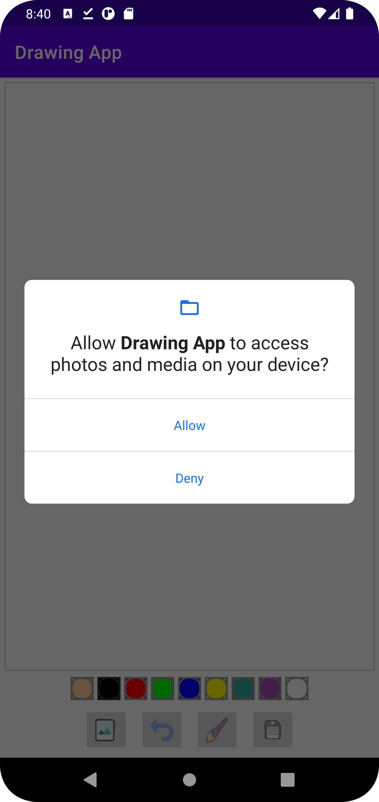
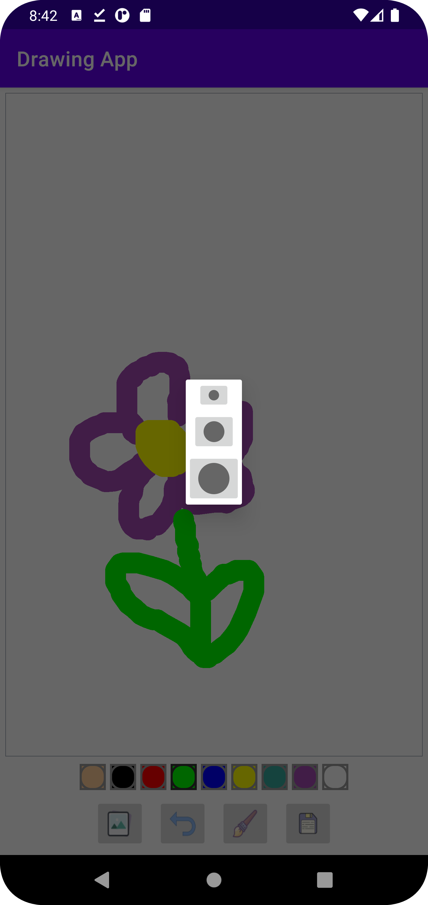
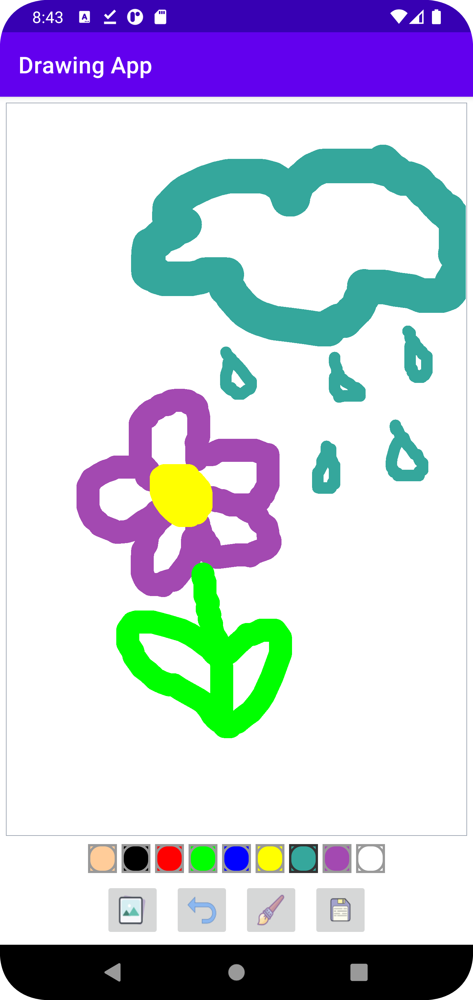
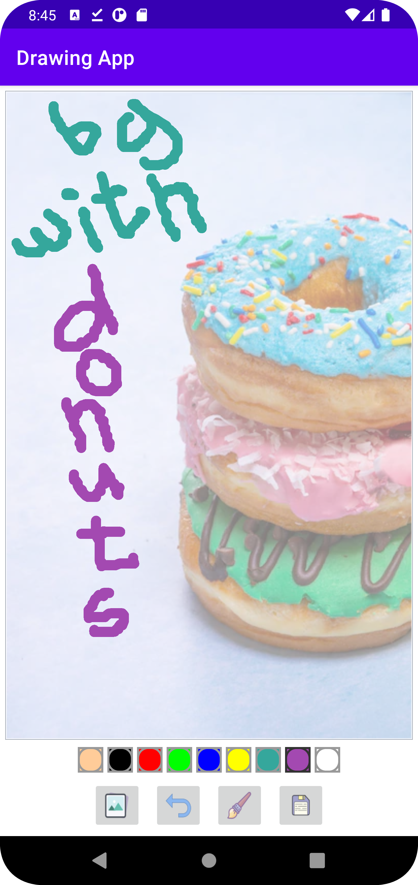
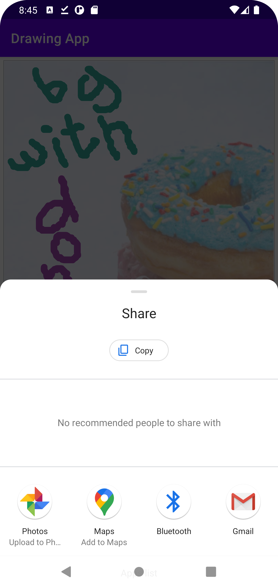

### Drawing App:
A drawing mobile app on Kotlin.

### Functionality:
#### You can:
- choose different colors
- choose brush size
- add background image
- undo drawings
- save drawings
- share drawings

### Screenshots:
</img>
</img>
</img>
</img>
</img>